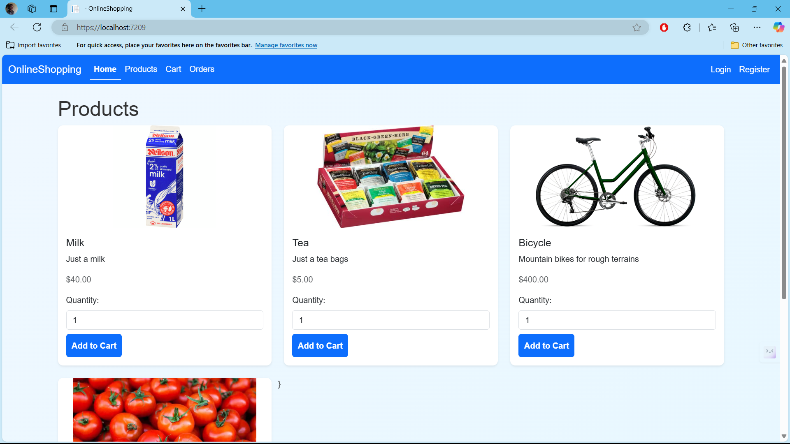

# Online Shopping Application

## Overview
The **Online Shopping Application** is a full-stack web application designed to provide users with a seamless e-commerce experience. It features a user-friendly interface for browsing products, managing carts, and placing orders. Additionally, it includes an admin panel for managing products, orders, and users.

---

## Features

### User Functionalities
- **Registration & Login**:  
  Users can register and securely log in to access their accounts.
- **Profile Management**:  
  View and update profile details such as email, address, and phone number.
- **Product Browsing**:  
  Explore products with details like images, descriptions, prices, and stock availability.
- **Cart Management**:  
  Add multiple products to the cart, modify quantities, and calculate total amounts.
- **Order Placement**:  
  Securely place orders via a mock credit card payment system.
- **Order History**:  
  View past orders with itemized details.

### Admin Functionalities
- **Admin Login**:  
  Admins can log in with a secure username and password.
- **Dashboard**:  
  View statistics for total users, products, and orders.
- **Product Management**:  
  - Add, update, and delete products.
  - Manage stock levels and upload product images via URLs.
- **Order Management**:  
  View detailed order history, including user information and purchased items.
- **User Management**:  
  View and manage registered user details.

---

## Technologies Used

### Frontend
- **HTML5, CSS3, Bootstrap**  
  For responsive and visually appealing UI/UX.

### Backend
- **ASP.NET Core MVC**  
  Implements the Model-View-Controller pattern for scalability and maintainability.
- **Entity Framework Core**  
  ORM for database interactions.

### Database
- **SQL Server**  
  Stores user, product, order, and admin data.

### Tools
- **Session Management**:  
  Handles authentication and cart functionalities.
- **Version Control**:  
  Git for source control.

---

## Setup Instructions

### Prerequisites
1. Install **.NET Core SDK**.
2. Install **SQL Server**.
3. Install a code editor like **Visual Studio** or **VS Code**.

### Steps to Run Locally
1. **Clone the repository**:
   ```bash
   git clone https://github.com/yourusername/online-shopping-application.git
   cd online-shopping-application
    ```


2. **Set up the database:**
- Update the appsettings.json file with your SQL Server connection string.
- Apply migrations and seed the database:
```bash
dotnet ef database update
```

3. **Start the application:**
```bash
dotnet run
```

## Usage Instructions

### User Workflow
1. **Register or Log In**:  
   - Create an account or log in to access your personal dashboard.
2. **Browse Products**:  
   - Explore a wide range of products, view details like images, descriptions, prices, and stock availability.
3. **Add to Cart**:  
   - Select desired items and add them to your cart. You can modify quantities as needed.
4. **View Cart**:  
   - Review the items in your cart, adjust quantities, and see the total amount.
5. **Place Order**:  
   - Proceed to checkout, enter the required details, and place your order.

---

### Admin Workflow
1. **Log In**:  
   - Access the admin panel using the following credentials:  
     - **Username**: `admin01`  
     - **Password**: `sky12345`
2. **Admin Dashboard**:  
   - Get a summary of total users, products, and orders.
3. **Manage Products**:  
   - Add, update, or delete product listings.
4. **User Management**:  
   - View and manage registered user details.
5. **Order History**:  
   - Access detailed order information, including user details and purchased items.

---

## Screenshots
- **Home Page**
- **Admin Dashboard**
- **Product Page**

*Screenshots to be added soon.*

---

## Future Enhancements
- **Real Payment Gateway Integration**:  
  Implement services like Stripe or PayPal for secure transactions.
- **Product Categories and Search Filters**:  
  Improve user experience with advanced search and filtering options.
- **Order Tracking**:  
  Allow users to track their orders in real-time.
- **Role-Based Access Control**:  
  Provide finer-grained permissions for admin and user functionalities.

---

## License
This project is open for contributions and improvements. Feel free to fork and submit pull requests!